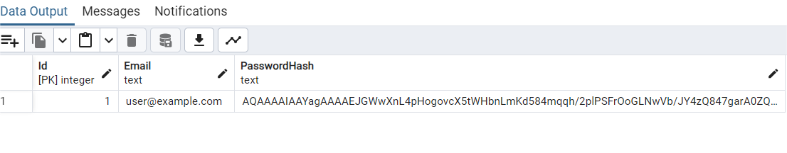

# Identity and Data Protection API

Bu proje, kullanıcı kayıt işlemleri ve kimlik doğrulama için temel bir API sunar. **ASP.NET Core** ve **Identity** kullanarak oluşturulmuş bir uygulamadır.

## Proje Yapısı

- **UserController**: Kullanıcı kayıt işlemleri gibi kullanıcı ile ilgili işlemleri yönetir.
- **UserService**: Kullanıcı işlemleri için iş mantığını içerir.
- **AppDbContext**: Veritabanı bağlantısını sağlar ve kullanıcıları saklar.
- **UserRegister**: Kullanıcı kaydı için gerekli veri modelidir.
- **User**: Kullanıcı bilgilerini tutan temel varlıktır.

## Kurulum

1. **Proje dosyalarını indirip açın:**
   - Visual Studio veya Visual Studio Code gibi bir IDE kullanabilirsiniz.

2. **Bağımlılıkları yükleyin:**
   ```bash
   dotnet restore
   ````
3. Veritabanı bağlantısı yapın: `appsettings.json` dosyasındaki Default bağlantı dizesini kendi veritabanı bilgilerinize göre düzenleyin.
4. Projeyi başlatın:
 ```bash
   dotnet run
   ````
## API Endpoint'leri
* POST /api/user/register

* Kullanıcı kaydını başlatır.
* Body:
```json
{
    "email": "user@example.com",
    "password": "strongpassword"
}
````
* Response: Başarılı kayıt durumunda kullanıcı bilgisi döndürülür.

